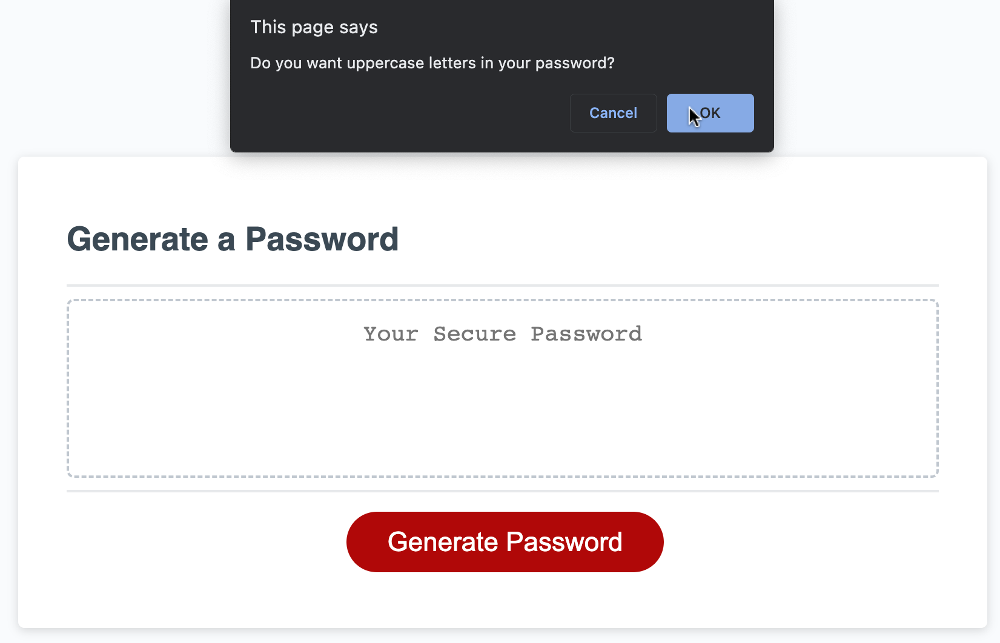
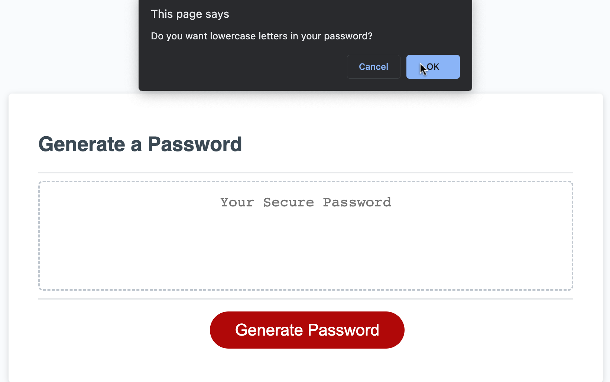
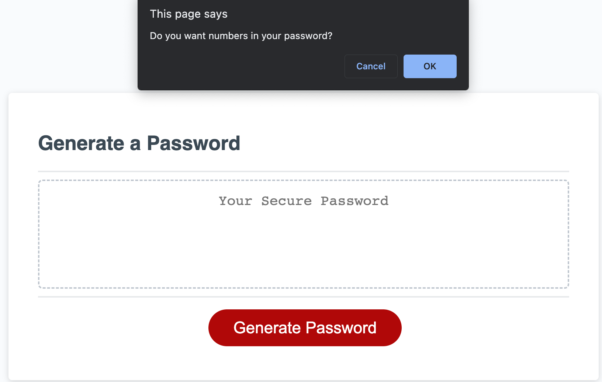
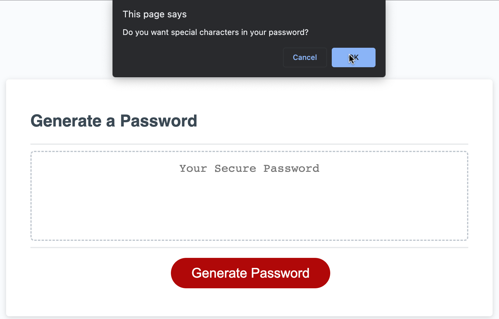
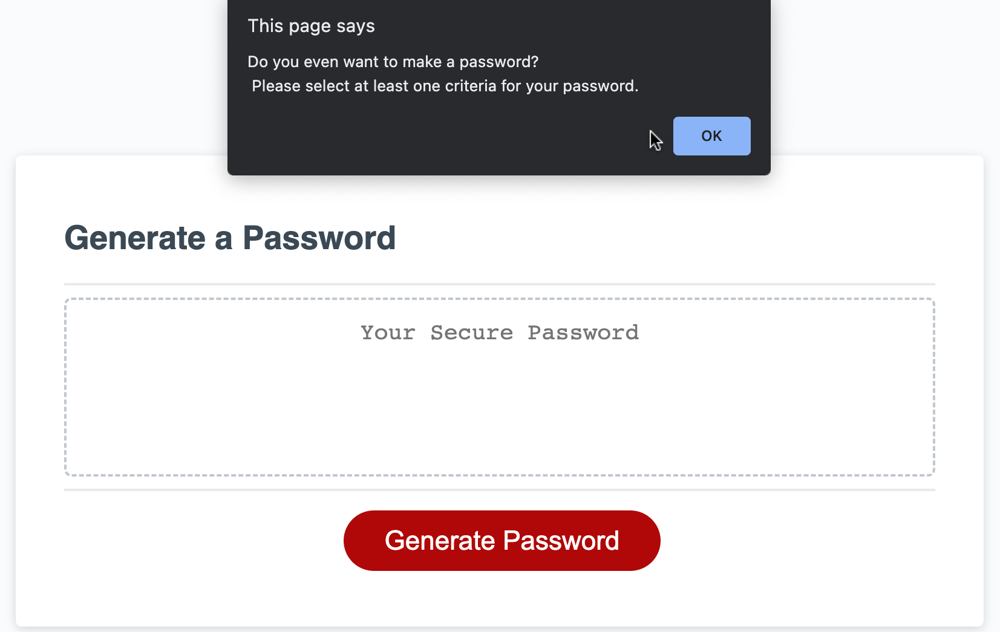
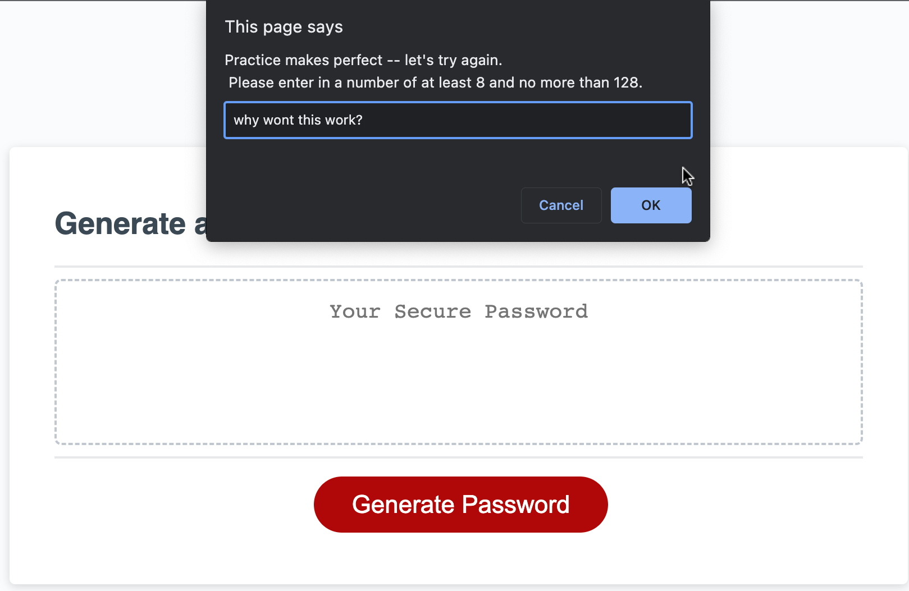
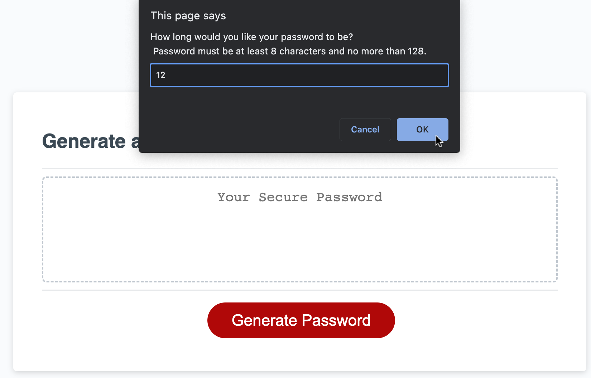
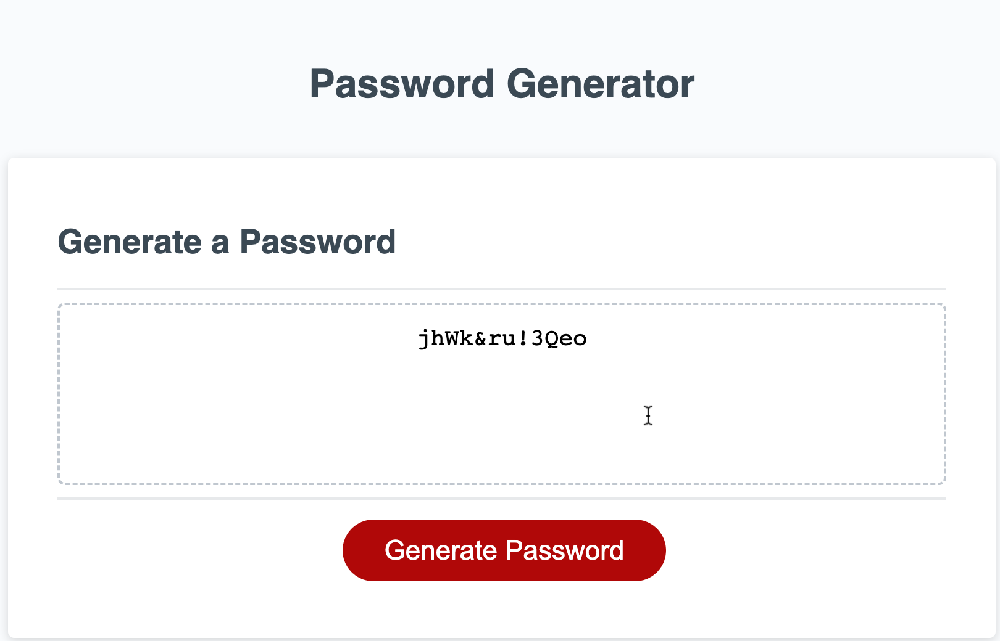

# Password-Generator

## Description

This is a password generator made for the purpose of its namesake -- generating a password -- a strong, randomized password, which can be used to set up security for various technology platforms, be it accounts, files, etc. This password generator was crafted with HTML, CSS, and JavaScript.

Too often, people create passwords that are not strong, possibly even containing guessable words that pertain to their personal information. This generator helps create a totally random password with personalized criteria to the user's liking. The generator chooses from the capitalized alphabet, lowercased alphabet, numbers, and special keyboard characters of various punctuation. The generator pulls from these cateogories and shuffles the characters around to create a truly difficult password to crack, solving the problem of unsecure passwords.

In this challenge, I learned more about the syntax of JavaScript code, as well as how to utilize variables in a more meaningful way and how to concat and have those variables change throughout the page of code.
I also learned how to create and utilize alert, confirm, and prompt boxes, as well as how to keep them looping when sufficient criteria is not met.

## Installation

N/A

## Usage

Upon landing on the page, when the user clicks "Generate Password," they wlll be presented with messages to confirm which criteria they would prefer to have included in their generated password: uppercase letters, then lowercase letters, then numbers, then special characters. They may click "OK" to include or "cancel" to exclude.

Please see the following screenshots to see user's POV:

If the user is being difficult, they will be alert that they have to choose at least one criteria for the password generator, because otherwise, no password can be created!

After the user has selected the criteria they want in their password, they will be asked how many characters they want their password to be -- it must be at least 8 characters but no more than 128.

If they do not follow instructions (eg: choose a number less than 8, more than 128, or dont even include numbers), they will receive the following prompt repeatedly until they learn to follow basic instructions.

Once they enter a valid number, their password will be generated!

## Credits

Starter code was provided by edX.

## Projefct Repository

Please enjoy the deployed application [here](url)!